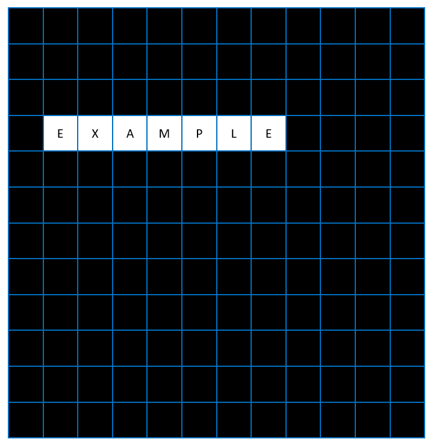
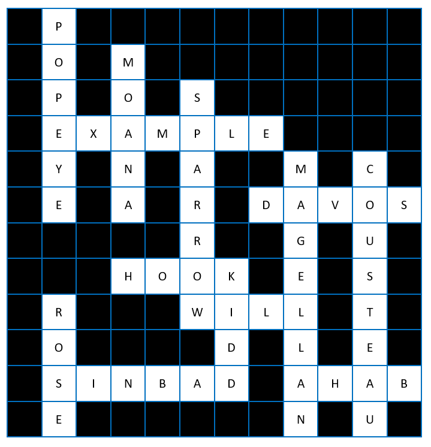
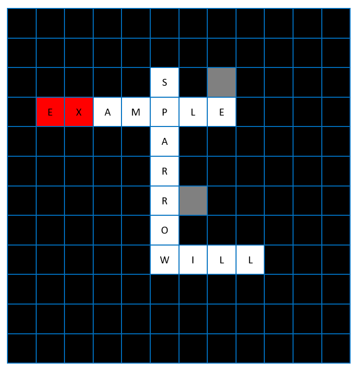
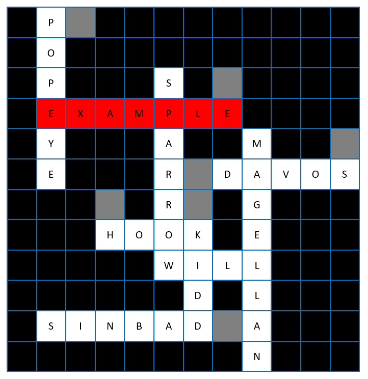
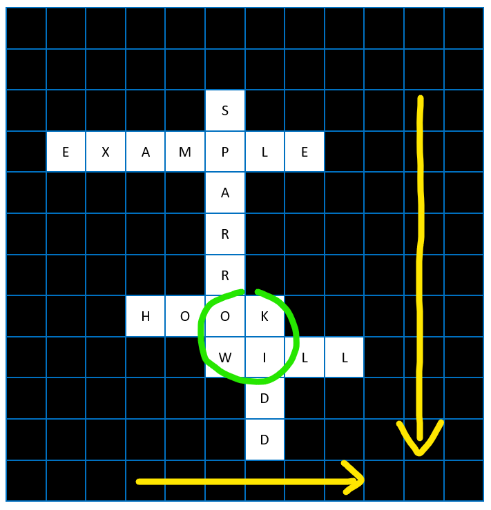

<h1 style="text-align: center;"> NXT Battleship </h1>

<h2 style="text-align: center;"> 🚢 🛟 Crew Overboard! 🛟 🚢 </h2>

**LIVE DEMO:**
<https://rbarcode.github.io/nxt-battleship/>

NXT Battleship puts a novel spin on the classic game of Battleship<sup>TM</sup>. Rather than lob shells or shoot torpedoes at enemy ships unseen, your task is to throw out life preservers to the crew of the nautical NOETICA<sup>TM</sup>. 🛟 Each crew member will require as many life preservers as there are letters in their name.

But this is the dead of night with a new moon 🌑 and nary a star in the overcast sky☁️🌌, so the best you can do is guess the location of the crew in the water. Luckily, you know that at least one crew member has managed to maintain physical contact with the ship🚢🏊‍♀️, and the rest of the crew has managed to maintain physical contact with at least one other crew member🏊🏿🏊‍♂️. Use your knowledge of the crew’s names and understanding of basic logic to help you make informed throws!

But a word of caution! The ship only has 7 extra life preservers! 🛟 You can only afford to miss 6 times or the ship will be doomed to sink for lack of the entire crew safely aboard! 


### The Crew:
  
```js
theCrew = ['AARON',
            'AESA',
            'AVI',
            'DAN',
            'JODI',
            'MICHAEL',
            'MIKE',
            'MONTY',
            'OLIVIA',
            'RICHARD',
            'TARIQ',
            'TOM',
            'YONI']
```

### How to Play / Game Rules:

You must reveal the names of the entire crew letter-by-letter by clicking on the correct cells on the game grid. You can click on any cell that is black. Cells that have already been clicked either turn gray - if the guess was incorrect - or white, revealing the underlying letter - if the guess was correct.

The names of the crew are spelled vertically from top to bottom or horizontally from left to right.

Names never appear in isolation and only appear once. Names will always touch or intersect at least one other name or the ship or both. The ship (or seed_word) will always be touched or intersected by at least one name. (The corners of cells diagonally across from each other do not count as touching.)

### Winning Condition:

The game is won when you have revealed the names of the entire crew. This equals 46 correct guesses - the total number of letters in the crew’s names in the given list above - before exceeding the limit of 6 incorrect guesses.

### Losing Condition:

You are allowed six (6) incorrect guesses. On your seventh incorrect guess, the game is over and you lose. Each time you guess incorrectly, one of the previously white cells of the ship (or seed_word) turns red. You can keep track of how many incorrect guesses you’ve made by counting the red cells of the ship or the gray cells throughout the game grid.

### Visual Game Example:

```js
visualExampleList = ['AHAB', 'COUSTEAU', 'DAVOS', 'HOOK', 'KIDD', 'MAGELLAN', 
                    'MOANA', 'POPEYE', 'ROSE', 'SINBAD', 'SPARROW', 'WILL']
```

#### Game Start


#### Game Over (Won) / Solution


NOTE: The solution is shown in a simplified “clean” state without any incorrect guesses for the sake of clarity.

#### In-Progress Game After 2 Incorrect Guesses


#### Game Over (Lost)
  

#### IMPORTANT NOTE:  
NXT Battleship uses the American-style crossword puzzle rule that all letters are 'checked' - that is, each white cell that is abutted both vertically and horizontally by another white cell appears in both a word across and a word down. See the example below:



*This rule/logic has important implications for guessing strategies! For example, you know that Cell X - which is horizontally adjacent to Cell Y and vertically adjacent to Cell Z, both of which contain letters - cannot contain a letter because there is no way to make a name from the list in both directions.*

## Development

Clone the repository
```bash
$ git clone https://github.com/rbarcode/nxt-battleship.git
```

Navigate to the directory
```bash
$ cd nxt-battleship
```

Open the project in your editor
```bash
$ code .
```

## License

MIT License

Copyright (c) 2024 Richard Barbour II

Permission is hereby granted, free of charge, to any person obtaining a copy of this software and associated documentation files (the "Software"), to deal in the Software without restriction, including without limitation the rights to use, copy, modify, merge, publish, distribute, sublicense, and/or sell
copies of the Software, and to permit persons to whom the Software is furnished to do so, subject to the following conditions:

The above copyright notice and this permission notice shall be included in all copies or substantial portions of the Software.

THE SOFTWARE IS PROVIDED "AS IS", WITHOUT WARRANTY OF ANY KIND, EXPRESS OR IMPLIED, INCLUDING BUT NOT LIMITED TO THE WARRANTIES OF MERCHANTABILITY, FITNESS FOR A PARTICULAR PURPOSE AND NONINFRINGEMENT. IN NO EVENT SHALL THE AUTHORS OR COPYRIGHT HOLDERS BE LIABLE FOR ANY CLAIM, DAMAGES OR OTHER LIABILITY, WHETHER IN AN ACTION OF CONTRACT, TORT OR OTHERWISE, ARISING FROM,
OUT OF OR IN CONNECTION WITH THE SOFTWARE OR THE USE OR OTHER DEALINGS IN THE SOFTWARE.
